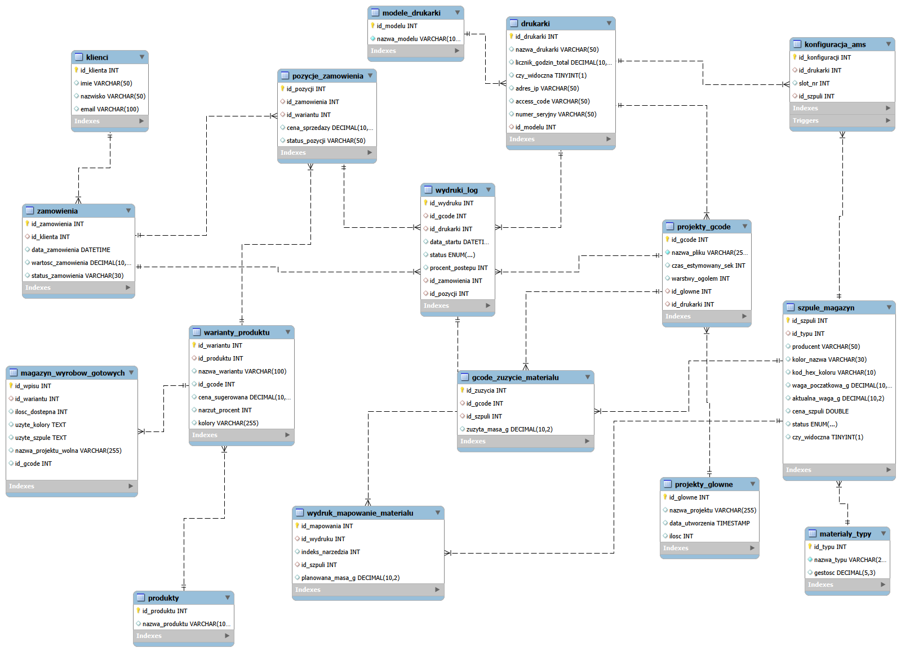

# System Zarządzania Farmą Drukarek 3D

Autorski projekt relacyjnej bazy danych stworzony w środowisku MySQL, mający na celu wsparcie procesu produkcji przyrostowej (druku 3D).

## Cel projektu
Głównym zadaniem bazy jest kompleksowe zarządzanie:
* Flotą urządzeń (drukarek 3D) oraz monitorowaniem logów wydruków.
* Gospodarką magazynową materiałów (filamentów), w tym automatycznym śledzeniem zużycia ze szpul zintegrowanych z systemami typu AMS.
* Procesem sprzedażowym: od klientów, poprzez zamówienia, aż po magazyn wyrobów gotowych.

## Diagram Bazy Danych (ERD)

## Wykorzystane technologie
* **MySQL**
* Relacyjny model danych (PK, FK)
* Wykorzystanie typów wyliczeniowych (ENUM) dla statusów procesów

## Zawartość repozytorium
* `schema.sql` - skrypty DDL tworzące tabelaryczną strukturę systemu.
* `query.sql` - zapytania DML realizujące analizę danych (np. raportowanie skuteczności wydruków na poszczególnych maszynach, inwentaryzacja filamentów).
